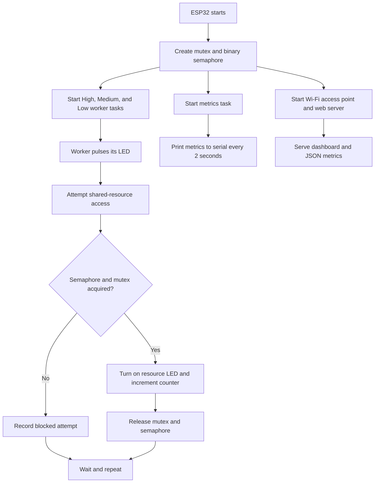

# ESP32 FreeRTOS Shared Resource Dashboard

An ESP32 demonstration of FreeRTOS task scheduling, shared-resource contention,
mutex protection, semaphore-based access control, and live system monitoring.

The project runs three worker tasks with different priorities. Each task repeatedly
performs simulated work and attempts to increment the same global counter. LEDs,
serial output, and a browser dashboard show which tasks are running, how often
access succeeds, and how often tasks are blocked by synchronization.

## Project Features

- Three concurrent FreeRTOS worker tasks with high, medium, and low priorities
- Shared counter accessed by all worker tasks
- Mutex protection for safe counter updates
- Binary semaphore gate for demonstrating blocked access
- Four LEDs for visualizing task and shared-resource activity
- ESP32 Wi-Fi access point with no external network required
- Responsive browser dashboard with live metrics
- Serial metrics summary every two seconds
- Compile-time switches for comparing protected and unprotected behavior

## How the Project Works

At startup, the ESP32 creates a mutex, a binary semaphore, three worker tasks,
and one metrics task.

Each worker task follows this loop:

1. Pulse its assigned LED to show that it has been scheduled.
2. Wait for a random simulated-work interval.
3. Record an attempt to access the shared resource.
4. Request the binary semaphore and mutex.
5. If access is granted, read and increment the shared counter.
6. Turn on the shared-resource LED while the counter is being modified.
7. Release the mutex and semaphore.
8. Wait for a random idle interval and repeat.

The random delays cause the tasks to compete for the resource at different
times. Because the tasks use different FreeRTOS priorities, the experiment also
shows how scheduling priority affects activity and contention.



## Synchronization Behavior

Two compile-time switches near the top of the sketch control synchronization:

```cpp
#define USE_MUTEX_PROTECTION 1
#define USE_ACCESS_SEMAPHORE 1
```

### Mutex

The mutex protects the read-modify-write operation on `sharedCounter`. Without
the mutex, two tasks can read the same value before either writes its result,
causing increments to be lost.

### Binary Semaphore

The binary semaphore acts as an additional access gate. A task waits briefly for
the semaphore; if it cannot acquire it, the attempt is counted as blocked. This
makes contention visible in the dashboard and serial metrics.

### Experiment Modes

| Mutex | Semaphore | Behavior |
| --- | --- | --- |
| `1` | `1` | Safe counter access with visible blocking |
| `1` | `0` | Safe counter access using only the mutex |
| `0` | `1` | Serialized access through the semaphore |
| `0` | `0` | Intentionally unsafe mode that can lose counter updates |

After changing either switch, compile and upload the sketch again.

## Hardware Requirements

- ESP32 development board
- Four LEDs
- Four suitable current-limiting resistors, commonly 220 to 330 ohms
- Breadboard and jumper wires
- USB data cable

## Wiring

Connect each GPIO to an LED through a current-limiting resistor. Connect each
LED cathode to ESP32 ground.

| Purpose | ESP32 GPIO | Behavior |
| --- | ---: | --- |
| High-priority task LED | 25 | Pulses when the high-priority task runs |
| Medium-priority task LED | 26 | Pulses when the medium-priority task runs |
| Low-priority task LED | 27 | Pulses when the low-priority task runs |
| Shared-resource LED | 33 | Lights while the counter is being modified |

## Dashboard

The ESP32 creates its own Wi-Fi access point:

| Setting | Value |
| --- | --- |
| Network name | `ESP32-RTOS-Dashboard` |
| Password | `esp32rtos` |
| Dashboard URL | `http://192.168.4.1/` |

The dashboard refreshes once per second and displays:

- Global shared-counter value
- Mutex and semaphore status
- Overall success and contention rates
- Attempts, successes, blocked attempts, and last observed counter per task
- Most active task
- Current resource state and most recent shared-resource owner
- Recent activity trends

The root route `/` serves the dashboard. The `/metrics` route returns the live
system state as JSON.

## Serial Output

Open the serial monitor at `115200` baud. The sketch prints individual access
events and a summary every two seconds:

```text
===== RTOS Shared Resource Metrics =====
Global Counter: 42
HIGH   -> attempts=18 successes=16 blocked=2 last=42
MEDIUM -> attempts=15 successes=13 blocked=2 last=41
LOW    -> attempts=14 successes=13 blocked=1 last=40
RESOURCE -> active=NO owner=HIGH
Protection: mutex=ON, accessSemaphore=ON
```

## Code Overview

The complete application is in
[`RTS_project/RTS_project.ino`](RTS_project/RTS_project.ino).

### Configuration and Statistics

- `TaskConfig` stores each worker's name, priority, LED pin, and pulse duration.
- `TaskStats` stores attempts, successful accesses, blocked accesses, and the
  last observed shared-counter value.
- `HIGH_TASK`, `MEDIUM_TASK`, and `LOW_TASK` define FreeRTOS priorities `3`,
  `2`, and `1`.

### Important Functions

| Function | Responsibility |
| --- | --- |
| `setup()` | Initializes hardware, synchronization objects, Wi-Fi, and tasks |
| `loop()` | Services incoming dashboard HTTP requests |
| `stressTask()` | Runs the repeating workload for each worker task |
| `tryEnterResource()` | Attempts to acquire the semaphore and mutex |
| `accessSharedResource()` | Safely increments the counter and updates metrics |
| `leaveResource()` | Releases synchronization objects |
| `metricsTask()` | Prints a consistent metrics snapshot to serial |
| `captureStatsSnapshot()` | Copies shared metrics inside a critical section |
| `startDashboard()` | Starts the access point and HTTP server |
| `handleDashboardRoot()` | Serves the dashboard HTML from flash memory |
| `handleDashboardMetrics()` | Builds and returns live JSON metrics |

The worker tasks and metrics task are pinned explicitly to the ESP32 cores:

- Worker tasks run on core `1`.
- The metrics task runs on core `0`.
- Arduino's `loop()` services the web server.

Statistics updates use an ESP32 critical-section lock (`portMUX_TYPE`) so the
dashboard and serial output can safely copy task statistics while worker tasks
continue running.

## Upload with Arduino IDE

1. Install Arduino IDE 2.x.
2. Install **esp32 by Espressif Systems** from Boards Manager.
3. Open `RTS_project/RTS_project.ino`.
4. Select **Tools > Board > esp32 > ESP32 Dev Module**.
5. Select the ESP32's USB serial port.
6. Click **Upload**.
7. Open Serial Monitor and set the baud rate to `115200`.

If upload fails while connecting, hold the ESP32 `BOOT` button while the IDE
starts uploading, then release it once writing begins.

## Build and Upload with PlatformIO

The included `platformio.ini` targets a generic ESP32 development board.

```powershell
py -m platformio run
py -m platformio run --target upload
py -m platformio device monitor
```

## Troubleshooting

### ESP32 port is missing

- Use a USB cable that supports data, not only charging.
- Install the USB-to-serial driver required by the board, commonly CP210x or
  CH340.
- Reconnect the board and restart Arduino IDE.

### Dashboard does not open

- Confirm the computer or phone is connected to `ESP32-RTOS-Dashboard`.
- Open `http://192.168.4.1/` directly.
- Some devices warn that the Wi-Fi network has no internet; remain connected.
- Check the serial monitor for the access-point IP address.

### LEDs do not light

- Check LED polarity and ground connections.
- Confirm that every LED has a current-limiting resistor.
- Confirm the GPIO mapping matches the wiring table.

### Tasks report many blocked attempts

This is expected under contention. Increase the semaphore and mutex wait times
or reduce the resource-hold interval if lower blocking is desired.

## Repository Structure

```text
.
|-- RTS_project/
|   `-- RTS_project.ino
|-- .gitignore
|-- platformio.ini
`-- README.md
```

## Safety Note

Do not connect an LED directly between an ESP32 GPIO and ground without a
current-limiting resistor. The ESP32 uses 3.3 V logic.
